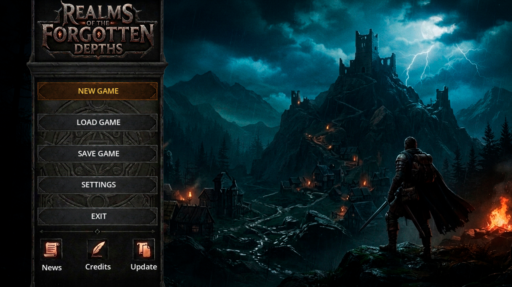

# Realms of the Forgotten Depths

**Realms of the Forgotten Depths** is a 2.5D top-down dark medieval RPG focused on adventure and crafting. The core of the project is a complex, tier-based crafting system utilizing specialized material processing buildings, moving resources from raw materials to processed components and final products.

The project is built and tested using **Godot 4.7.1**.

---

## 📸 Preview



---

## 🎮 Current Project Status

The game is currently in early, active development. The implemented features include:

* **Splash Screen:** Initial loading and intro screen.
* **Main Menu:** Fully functional main menu layout.
* **User Interface (UI):** Top Bar and Bottom Bar components are currently under active development and integration.

### Upcoming Features (Roadmap)
The game architecture is designed to integrate new modular systems incrementally:
- [ ] Map and exploration systems.
- [ ] Processing buildings and refining stations.
- [ ] Resource gathering zones for basic farming.
- [ ] Full implementation of the Tier-Based Crafting logic.

---

## 🛠️ Crafting System Core

The economy and gameplay revolve around a deep, multi-tiered crafting loop:

1. **Basic Materials:** Raw resources gathered directly from the world.
2. **Processed Materials:** Refined items produced via specialized infrastructure.
3. **Final Products:** High-value gear, consumables, or equipment ready for use.

---

## 🕹️ Controls

| Action | Primary Keys | Secondary Keys |
| :--- | :--- | :--- |
| **Movement** | `W`, `A`, `S`, `D` | `Arrow Keys` |
| **Inventory** | `I` | — |

---

## 🚀 Getting Started

To run or contribute to this project, you will need:

1. Download and install [Godot Engine 4.7.1](https://godotengine.org).
2. Clone this repository:
   ```bash
   git clone https://github.com/ZeusOneRG/carpg
   ```
3. Import the project into the Godot Project Manager by selecting the `project.godot` file.

---

## 🤝 Contributing

Contributions are welcome! Whether you want to fix bugs, optimize performance, improve the UI, or help design the crafting tier system, your help is highly appreciated.

### How to Contribute
1. **Fork** the repository.
2. Create a new branch for your feature (`git checkout -b feature/AmazingFeature`).
3. **Commit** your changes (`git commit -m 'Add some AmazingFeature'`).
4. **Push** to the branch (`git push origin feature/AmazingFeature`).
5. Open a **Pull Request**.

### Current Needs
* **Map Design & Exploration:** Assistance in building and structuring the 2D world and exploration zones.
* **UI Integration & Menus:** Helping finish the Top/Bottom bars and designing specialized UI processing menus for future production buildings.
* **Core Mechanics:** Developing and refining the multi-tier crafting loop, health/mana bars, and future mob/boss AI mechanics.
